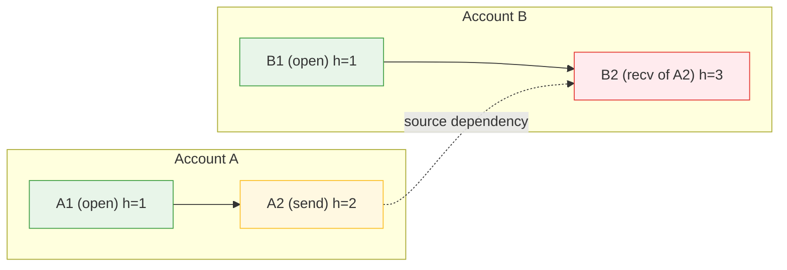
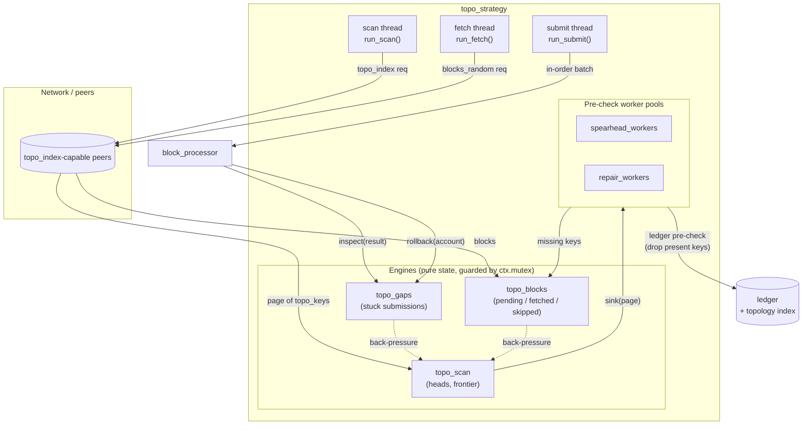
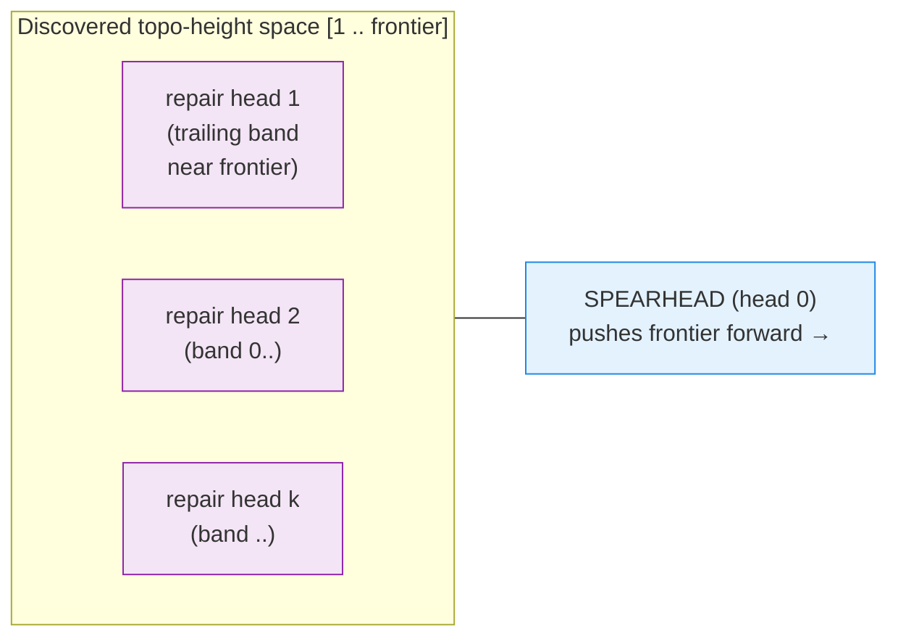
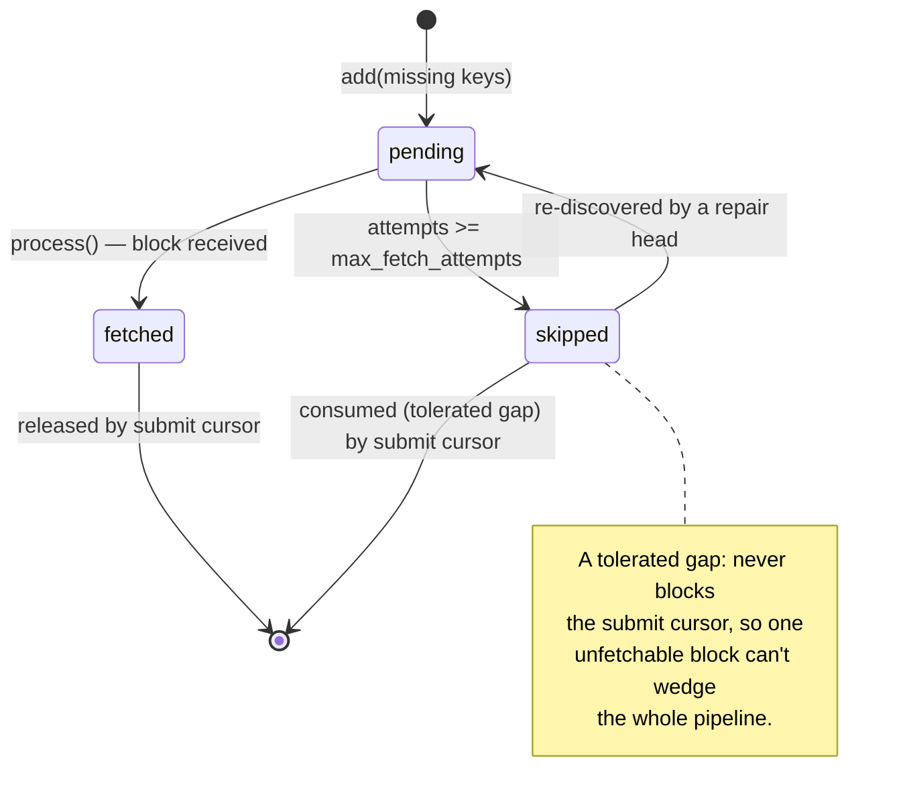
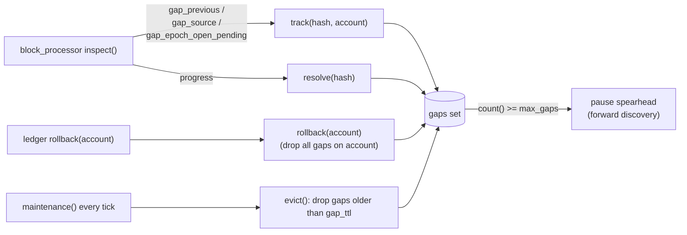
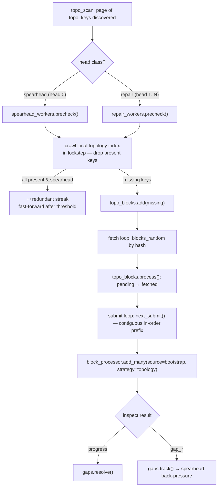

# Topological Bootstrap

This document describes the **topological bootstrap** strategy introduced on the `topo`
branch (commit `069ed59fc Introduce topo bootstrap`, diffed against `upstream-dev`). It
explains the idea, the on-disk topology index it builds on, the new wire messages, the
runtime architecture, and the back-pressure machinery that keeps it stable.

---

## 1. Motivation

Classic Nano bootstrap is **account-centric**: a node pulls account frontiers, then walks
each account's chain, and discovers cross-account dependencies (the `link`/`source` of a
receive block) lazily. A block that depends on a send in some *other* account can only be
applied once that other chain has also been pulled, so the block processor sees a constant
churn of `gap_source` / `gap_previous` results and the same block is retried many times
before its dependency happens to arrive. Ordering is emergent, not guaranteed.

The topological bootstrap turns this around. Every block in the ledger is assigned a
**topological height** — `1 + max(height of its dependencies)` — and that height is stored
in an ordered index. Walking the index in ascending order yields a **globally
dependency-safe order**: a block's dependencies always have a strictly smaller height, so
if we submit blocks in index order, every block's dependencies have already been submitted.

The strategy therefore:

1. **Scans** peers' topology indexes to discover which `(height, hash)` keys exist.
2. **Pre-checks** those keys against the local ledger and keeps only the missing ones.
3. **Fetches** the missing blocks by hash (random-block requests).
4. **Submits** them to the block processor *in topological order*, so dependencies land
   before dependents and the gap-retry churn largely disappears.

---

## 2. Foundation: the topology index

> The index itself (`topo_height` on the block sideband, the `topology_view` store table,
> and `ledger::populate_topo_index`) already exists on `upstream-dev`. The topo bootstrap
> is the first *consumer* of it. It is summarized here because the bootstrap design depends
> on its properties.

### `topo_key`

```cpp
class topo_key {
    uint64_t          topo_height{ 0 };
    nano::block_hash  hash{ 0 };
    auto operator<=>(topo_key const&) const = default; // orders by (height, then hash)
};
```

A `topo_key` is the index's primary key. The ordered table `store.topology` holds exactly
one key per block.

### How `topo_height` is computed

`ledger::populate_topo_index` performs a bounded DFS over every block:

```
topo_height(block) = 1 + max(topo_height(dep) for dep in block.dependencies())   // min 1
```

Genesis (and epoch-open blocks) sit at height `1`. The crucial invariant, asserted during
population:

> **For every block, each dependency has a strictly smaller `topo_height`.**

Because a block at height `h` always depends on something at height `h-1`, heights are
**densely packed** — a contiguous page of the index never skips a height by more than one.
The wire-level verifier relies on this (see §4).



`B2` receives from `A2`, so `B2.height = A2.height + 1 = 3`. Submitting in height order
(`1 → 1 → 2 → 3`) guarantees `A2` is applied before `B2`.

---

## 3. New wire protocol

Two new `asc_pull` request/response types were added (`nano/messages/asc_pull.{hpp,cpp}`),
alongside a new bootstrap-server capability negotiation.

| Type | Request payload | Response payload | Purpose |
|------|-----------------|------------------|---------|
| `topo_index` (`0x5`) | `topo_key start`, `uint16 count` | `deque<topo_key> entries` (≤ 1637) | Page through a peer's topology index from `start` |
| `blocks_random` (`0x4`) | `deque<block_hash> hashes` (≤ 128) | `deque<block>` (reuses `blocks_payload`) | Fetch arbitrary blocks by hash, no chain ordering |

A `topo_index` reply is a **contiguous ascending page** of the peer's index starting at the
first key `>= start`. `blocks_random` is used for fetching because the missing blocks we
discover are scattered across many accounts and heights — there is no single chain to walk.

### Capability negotiation

Peers advertise a `node_capabilities` bitset (`nano/lib/node_capabilities.hpp`):

```cpp
enum class node_capabilities : uint64_t {
    none        = 0,
    topo_index  = 1ULL << 0,   // can answer topo_index requests
    vote_storage= 1ULL << 1,
};
```

Only peers that advertise `topo_index` are eligible to be sampled (enforced by the
`peer_pool`, §9). `blocks_random` fetches are *temporarily* gated on the same capability
(a TODO notes this should become a protocol-version check).

---

## 4. Response verification

`nano/node/bootstrap/verify.cpp` validates every reply before it is processed and returns
`ok` / `nothing_new` / `invalid`.

For a `topo_index` page:

- entries must be non-empty, `<= count`, and `front >= start`;
- entries must be **strictly ascending**;
- adjacent heights may step up by **at most one** (the dense-packing invariant) — a larger
  jump means the peer skipped index entries and the page is rejected as `invalid`.

For a `blocks_random` reply: every returned block must have been requested, with no
duplicates (there is no chain to validate, so set-membership is the only check).

---

## 5. Runtime architecture

The strategy (`topo_strategy`) owns **three driver threads**, **two worker pools**, and
**three in-memory engines**, all coordinated through the shared `bootstrap_context` mutex
and condition variable.



### The three driver loops

| Thread | Loop body | Job |
|--------|-----------|-----|
| `scan_thread` | `scan_one()` | Ask `topo_scan` for the next page-scan round, fan it out to peers |
| `fetch_thread` | `fetch_one()` | Ask `topo_blocks` for the next batch of missing hashes, fetch them |
| `submit_thread` | `submit_one()` | Drain the next in-order batch of fetched blocks into the block processor |

Each loop is a `while (!stopped)` that drops the mutex, does one unit of work, and
re-acquires it. `ctx.wait(predicate)` is used to block until the engine has work and
back-pressure permits it.

---

## 6. The scan engine (`topo_scan`)

This is the heart of the design. It walks peers' topology indexes across multiple **heads**,
each a cursor into topo-height space.

### Heads: one spearhead, N repair heads



- **Spearhead** (`head 0`): advances the **discovery frontier** forward into unseen
  topo-height space. It discovers brand-new tip blocks.
- **Repair heads** (`1..N`): each owns a frozen **band** `[lo, hi)` of the already-discovered
  range `[1, frontier]` and re-scans it for gaps that the spearhead's coarse sweep, dropped
  replies, or peer disagreement missed. When a sweep reaches the band end the head
  **disarms** and is re-armed onto a fresh band.

The number of repair heads scales with the frontier:
`ceil(frontier_height / repair_band_height)`, clamped to `[min_repair_heads,
max_repair_heads]`. `reconcile_heads()` only ever *adds* heads (the frontier is monotonic
within a session). Repair head 1 is special — it always sweeps the **trailing band** near
the frontier (`[frontier - skip_stride, frontier]`) so recently fast-forwarded regions are
healed promptly; the remaining heads divide the full range.

### A scan round, step by step

For a given cursor a head samples **`consideration`** distinct peers (`3` for the
spearhead, `1` for repair), aggregates their replies, keeps the smallest **`candidates`**
new keys, and only advances when at least the **floor** (`ceil(consideration/2)`) of peers
agree. Sampling several peers guards against a single lagging peer making us over-advance
past keys it hasn't seen.

```mermaid
sequenceDiagram
    participant Loop as scan_thread
    participant Scan as topo_scan
    participant Pool as peer_pool
    participant P as peers (×fanout)

    Loop->>Scan: next(gates)
    Note right of Scan: pick oldest-due head,<br/>reserve it, return fanout count
    Scan-->>Loop: request{ head, start, count, fanout, exclude }
    Loop->>Pool: wait_channels(topology, topo_index, exclude, fanout)
    Pool-->>Loop: leases (≤ fanout distinct peers) + exhausted?
    loop per lease
        Loop->>Scan: dispatch(head, start, id, node_id)
        Scan-->>Loop: true (or false → stale, drop)
        Loop->>P: topo_index{ start, count }
    end
    P-->>Loop: asc_pull_ack topo_index page
    Loop->>Scan: process(id, entries)
    Note right of Scan: aggregate, trim to candidates,<br/>maybe_advance()
    Scan->>Scan: sink(page) when round completes
```

### How a head advances (`maybe_advance`)

A round completes once enough distinct peers have replied (`completed >= target` and
`>= floor`). Then:

- **No new candidates** → the tip is idle (spearhead) or the band currently has no gaps
  (repair). The cursor stays put and cooldown paces the next poll.
- **New candidates** → advance to the **largest candidate that has floor-level support**,
  retire every discovered key up to that boundary as a **page**, and emit it to the
  `sink`. A minority-only tail never moves the cursor past keys most peers haven't
  confirmed.
  - Spearhead pushes `frontier = max(frontier, furthest)`.
  - A repair head that reaches its band's `hi` **disarms** (re-armed onto a fresh band by
    the next `next()`).

The retired page goes straight into the pre-check pipeline. **Pages are never dropped** —
the scan loop back-pressures on the pre-check queues so that dropping (which would strand a
key's block out of the buffer and let later blocks be released ahead of it as a false gap)
cannot happen.

### Request lifecycle & staleness

In-flight requests are tracked by `id → reservation{head, node_id, start}`. If a head has
advanced past `start` by the time a reply/timeout arrives, the reply is **stale** and
discarded — it was sampling a position the head already moved past. `dispatch()` likewise
returns `false` (drop the send) if the head advanced between `next()` and `dispatch()`.

`exhausted()` is called when the peer pool can't supply the full `consideration`; it lowers
the head's advance bar to the peers actually reached, possibly completing the round at once.
`starved()` reports when a head exhausted the pool but couldn't even reach its `floor` —
discovery is then stalled and `maintenance()` logs a throttled warning.

---

## 7. The blocks engine (`topo_blocks`)

Holds discovered-but-missing keys, drives random-block fetching, and releases fetched
blocks **in topological order**.

Entries are stored in a multi-index container ordered by `topo_key` (for the in-order
submit cursor) and hashed by block hash (to match fetch replies). Each entry is in one of
three states:



- **`pending`** — missing, awaiting fetch. `next()` hands out batches (≤ `fetch_batch = 128`
  hashes), respecting a per-entry `fetch_cooldown` and excluding peers already sampled for
  those entries.
- **`fetched`** — block in hand, awaiting in-order submission.
- **`skipped`** — could not be fetched after `max_fetch_attempts` rounds; demoted to a
  *tolerated gap* so it never wedges the submit cursor. A repair head re-discovering it
  re-arms it back to `pending`.

### In-order submission (`next_submit`)

The submit cursor walks entries from the smallest `topo_key` upward and releases a
contiguous prefix of `fetched`/`skipped` entries, **stopping at the first `pending`
entry** — that is a real gap, and releasing anything past it would violate topological
order. This is what guarantees dependencies reach the block processor before dependents.

---

## 8. The gaps engine (`topo_gaps`) — spearhead back-pressure

Even with in-order submission, a block can come back from the block processor with a gap
status (its dependency wasn't in the batch — e.g. the dependency is itself still missing
and was a tolerated `skip`, or arrived via another source). `topo_gaps` tracks these stuck
submissions; **its live count is the spearhead's back-pressure signal**.



While many submissions are stuck (`count() >= max_gaps`), forward discovery pauses so the
**repair heads** can re-discover and refill the missing dependencies. Gaps leave the set
when the block finally progresses, when its account is rolled back (ancestors changed under
us), or after `gap_ttl` — so a permanently-missing dependency can't wedge the spearhead
forever.

---

## 9. Peer pool & fan-out (`peer_pool`)

The `peer_pool` (which replaces the old `peer_scoring`) tracks every bootstrap-capable
channel along with its cached node id, advertised capabilities, and outstanding-request
load.

- `acquire(required, exclude)` reserves the **least-loaded** peer that has the required
  capability (`topo_index`) and is not excluded, returning its node id.
- A fan-out round calls `wait_channels(strategy, required, exclude, max)` which reserves up
  to `max` **distinct** peers (each pick excluded from the next), blocking only for the
  first lease of a fresh round; the rest are best-effort. `exhausted` is set when the
  capable pool runs dry before reaching `max`.
- `exclude` carries the peers already sampled for a given cursor/entry so a top-up round
  never re-samples them.
- `update()` adds newly connected channels and drops closed ones; `decay()` shrinks the
  load counters of requests whose responses were lost, so peers don't get permanently
  "stuck full".

---

## 10. End-to-end data flow



### Pre-check fast path

`precheck()` runs on a worker pool (off the message thread) so ledger reads don't block
networking. When the topo index is enabled it **crawls the local index in lockstep** with
the incoming page (both are in topo order) instead of doing a random lookup per key — a
present key in the index implies the block is present (pruning is disabled with the index).
Otherwise it falls back to per-hash `block_exists_or_pruned`.

### Fast-forward on resume

When a node restarts with a partially-synced ledger, the spearhead re-scans regions it
already has. After `redundant_skip_threshold` (3) consecutive **fully-redundant** spearhead
pages, it `orient()`s the frontier forward by `redundant_skip_stride` (10 000) heights,
skipping ahead instead of re-walking known space. A missing page resets the streak. (Repair
head 1's trailing band still covers the skipped-over region to catch anything real.)

---

## 11. Back-pressure summary

Three independent valves keep memory bounded and the pipeline balanced:

| Signal | Threshold | Effect |
|--------|-----------|--------|
| `blocks.total_count()` (buffer fill) | `max_buffered` (40 000) | Pause **all** discovery (scan loop) |
| pre-check queue depth (per class) | `max_precheck_tasks` (64) | Gate that head class's rounds (`include_spearhead` / `include_repair`) |
| `gaps.count()` (stuck submissions) | `max_gaps` (50 000) | Pause the **spearhead** only; repair heads keep refilling deps |

Crucially, gating happens in `topo_scan::next()` *before* a round is issued — a page is
**never** produced and then dropped, because dropping would strand its blocks out of the
ordered buffer and corrupt the in-order submit guarantee.

---

## 12. Server side (`bootstrap_server`)

A node answers both new request types from a read transaction:

- **`topo_index`**: seek the `store.topology` table to `>= start` and return up to `count`
  contiguous ascending keys.
- **`blocks_random`**: look up each requested hash and return the blocks found (missing
  ones are simply omitted).

Both are rate-limited by the server's per-batch limiter (the API was renamed from
`should_pass` to `try_consume`).

---

## 13. Configuration reference (`topo_scan_config`)

| Key | Default | Meaning |
|-----|---------|---------|
| `repair_band_height` | 2 000 000 | Topo-height each repair head sweeps; head count = frontier / this |
| `min_repair_heads` / `max_repair_heads` | 2 / 6 | Floor/cap on repair head count |
| `consideration_count` | 3 | Distinct peers the spearhead samples before advancing |
| `repair_consideration` | 1 | Distinct peers a repair head samples before advancing |
| `candidates` | `max_topo_entries - 1` | Smallest new keys kept per advance |
| `redundant_skip_threshold` | 3 | Consecutive redundant spearhead pages before fast-forward |
| `redundant_skip_stride` | 10 000 | Heights to jump on fast-forward |
| `cooldown` | 5 s | Per-head pacing between requests |
| `max_buffered` | 40 000 | Buffer-fill back-pressure for the whole scan |
| `fetch_batch` | 128 | Hashes per `blocks_random` request |
| `max_fetch_attempts` | 10 | Rounds before a block becomes a tolerated gap |
| `fetch_cooldown` | 2 s | Minimum retry interval per entry |
| `max_gaps` | 50 000 | Stuck-submission back-pressure for the spearhead |
| `gap_ttl` | 10 min | Evict a stuck gap after this long |

The strategy is enabled by `bootstrap.enable_topo_scan` (default `true`) and has its own
rate limiter (`topo_rate_limit`) and block-processor fair-queue bucket
(`strategy::topology`).

---

## 14. Comparison with account-centric bootstrap

| | Account bootstrap | Topological bootstrap |
|---|---|---|
| Discovery unit | account frontier + chain walk | topo-index page (`(height, hash)` keys) |
| Ordering | emergent; cross-account deps resolved by retry | globally dependency-safe by construction |
| Block processor churn | high (`gap_*` retries) | low (deps submitted before dependents) |
| Fetch shape | per-account chains | random blocks by hash, scattered |
| Requires | nothing extra | peers with the `topo_index` capability + populated index |

The topo strategy runs **alongside** the existing strategies (priority, database,
dependency, frontier) inside the same `bootstrap_context`; it does not replace them.

---

## Appendix: key source files

| File | Role |
|------|------|
| `nano/secure/common.hpp` (`topo_key`) | Index key type |
| `nano/store/ledger/topology.{hpp,cpp}` | Ordered topology table view |
| `nano/secure/ledger_topo_index.cpp` | One-time index population (`populate_topo_index`) |
| `nano/messages/asc_pull.{hpp,cpp}` | `topo_index` + `blocks_random` wire messages |
| `nano/node/bootstrap/topo_strategy.{hpp,cpp}` | Threads, pipeline orchestration |
| `nano/node/bootstrap/topo_scan.{hpp,cpp}` | Multi-head index scan engine |
| `nano/node/bootstrap/topo_blocks.{hpp,cpp}` | Missing-block buffer + in-order submit |
| `nano/node/bootstrap/topo_gaps.{hpp,cpp}` | Stuck-submission tracking / back-pressure |
| `nano/node/bootstrap/verify.cpp` | Response validation |
| `nano/node/bootstrap/peer_pool.{hpp,cpp}` | Capability-aware peer selection + fan-out |
| `nano/node/bootstrap/bootstrap_server.cpp` | Server-side request handling |
| `nano/node/bootstrap/bootstrap_config.hpp` | `topo_scan_config` tunables |
</content>
</invoke>
