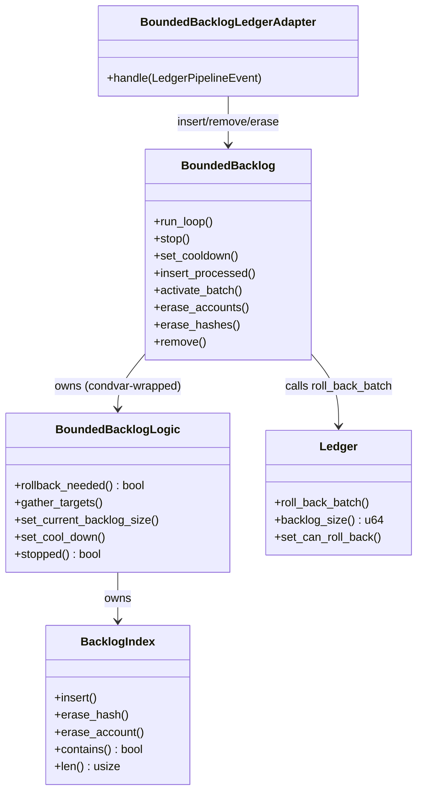

# Bounded Backlog

The Bounded Backlog keeps the number of unconfirmed blocks from growing without bound. When the unconfirmed block count exceeds a configured limit, it rolls back the lowest-priority blocks to bring the count back down.

## Why It Exists

Under heavy load or during a network partition, unconfirmed blocks can accumulate faster than they are confirmed. Without a bound, this would exhaust memory and degrade node performance. The Bounded Backlog acts as a safety valve: it tracks unconfirmed blocks in a priority index and, when the backlog is too large, discards the least important ones by rolling them back in the ledger.

## How It Works

Blocks are tracked in a `BacklogIndex` organized into priority buckets based on account balance (via `prio_bucket_index`). Lower-balance accounts occupy lower-indexed buckets and are rolled back first.

### Rollback thread (`BoundedBacklog`)

A single background thread wakes up whenever both of the following conditions are true:
1. The ledger's total unconfirmed block count exceeds `max_backlog`.
2. The tracked index also exceeds `max_backlog`.

Both conditions must hold to avoid reacting to transient spikes. When triggered, the thread:

1. Computes how many blocks to remove: `ledger_backlog - max_backlog`.
2. Scans buckets from lowest priority upward; a bucket is only a rollback candidate if it individually exceeds `max_backlog / bucket_count`.
3. Passes the gathered targets to `Ledger::roll_back_batch()`, which rolls back each target and its dependents.
4. Erases the rolled-back hashes from the index.

## Ledger Integration (`BoundedBacklogLedgerAdapter`)

The adapter listens for `LedgerPipelineEvent`s and keeps the index in sync:

| Event | Action |
|---|---|
| `BlocksProcessed` | Insert successfully processed blocks into the index |
| `BlocksConfirmed` | Remove confirmed blocks from the index |
| `BlocksRolledBack` | Erase rolled-back blocks from the index |

Because the adapter handles all ledger events, the index stays consistent without any additional reconciliation pass.

## Configuration

| Field | Default | Description |
|---|---|---|
| `max_backlog` | 100 000 | Maximum number of unconfirmed blocks before rollbacks begin |
| `batch_size` | 32 | Maximum blocks rolled back per loop iteration |

## Cooldown

The `set_cooldown(true)` method pauses rollbacks without stopping the thread. This is used during bootstrap and other phases where rolling back would be counterproductive. The rollback thread checks the cooldown flag before each rollback decision.

## Design

## Files

| File | Purpose |
|---|---|
| `mod.rs` | Re-exports |
| `app.rs` | `BoundedBacklog` application layer: detects overflow, tracks the index, and executes rollbacks |
| `ledger_adapter.rs` | Bridges ledger events to the bounded backlog |
