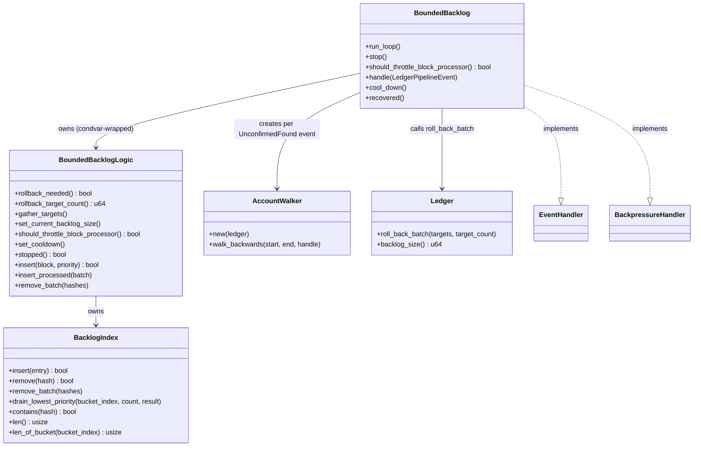

# Bounded Backlog

The Bounded Backlog keeps the number of unconfirmed blocks from growing without bound. When the unconfirmed block count exceeds a configured limit, it rolls back the lowest-priority blocks to bring the count back down.

## Why It Exists

Under heavy load or during a network partition, unconfirmed blocks can accumulate faster than they are confirmed. Without a bound, this would exhaust memory and degrade node performance. The Bounded Backlog acts as a safety valve: it tracks unconfirmed blocks in a priority index and, when the backlog is too large, discards the least important ones by rolling them back in the ledger.

## How It Works

Blocks are tracked in a `BacklogIndex` organized into priority buckets based on account balance (via `prio_bucket_index`). Lower-balance accounts occupy lower-indexed buckets and are rolled back first.

### Index population

The index is populated from two sources:

1. **`BlocksProcessed` events** — every newly accepted block is inserted immediately via `BoundedBacklogLogic::insert_processed()`.
2. **`UnconfirmedFound` events** — when `BacklogScan` discovers an account that has unconfirmed blocks, `BoundedBacklog` walks the chain backwards from the account's head block to the confirmed frontier, inserting each unconfirmed block that is not already tracked. This catches blocks that were unconfirmed before the node started tracking them.

### Rollback thread

A single background thread wakes up whenever both of the following conditions are true:
1. The ledger's total unconfirmed block count exceeds `max_backlog`.
2. The tracked index also exceeds `max_backlog`.

Both conditions must hold to avoid reacting to transient spikes. When triggered, the thread:

1. Reads the current ledger backlog size and updates `current_backlog_size` in the logic.
2. Updates the block-processor throttle flag (see [Block Processor Throttling](#block-processor-throttling) below).
3. Computes how many blocks to remove: `ledger_backlog - max_backlog`.
4. Scans buckets from lowest index (lowest balance) upward; a bucket is a rollback candidate only if it individually exceeds `max_backlog / bucket_count`.
5. Drains rollback targets from qualifying buckets via `drain_lowest_priority()`, which removes blocks with the highest `TimePriority` value first (= oldest receive time = lowest timestamp priority).
6. Passes the gathered targets to `Ledger::roll_back_batch()`, which rolls back each target and its dependents.

## Ledger Integration

`BoundedBacklog` implements `EventHandler<LedgerPipelineEvent>` and keeps the index in sync:

| Event | Action |
|---|---|
| `BlocksProcessed` | Insert successfully accepted blocks into the index |
| `BlocksConfirmed` | Remove confirmed blocks from the index |
| `BlocksRolledBack` | Remove rolled-back blocks from the index |
| `UnconfirmedFound` | Walk each account chain back from its head and insert any untracked unconfirmed blocks |

Because `BoundedBacklog` handles all relevant events, the index stays consistent without any additional reconciliation pass.

## Configuration

| Field | Default | Description |
|---|---|---|
| `max_backlog` | 100 000 | Maximum number of unconfirmed blocks before rollbacks begin |
| `rollback_batch_size` | 32 | Maximum blocks rolled back per loop iteration |

## Block Processor Throttling

In addition to rolling back blocks, `BoundedBacklog` signals the block processor to slow ingestion when the backlog grows severely. On each run-loop iteration the `should_throttle_block_processor` flag is updated:

- **Throttle on** when `current_backlog_size > max_backlog × 1.5`
- **Throttle off** when the backlog drops back to or below that threshold

Callers read this flag via `BoundedBacklog::should_throttle_block_processor()`. The flag is stored as an `AtomicBool` so it can be read without taking the logic lock.

## Cooldown

`BoundedBacklog` implements the `BackpressureHandler` trait. When the upstream pipeline signals back-pressure, `cool_down()` is called, which sets the internal cooldown flag and wakes the run-loop thread; `recovered()` clears the flag. While the cooldown flag is set, `rollback_needed()` returns `false`, so the rollback thread skips rollback decisions without stopping.

## Design

## Files

| File | Purpose |
|---|---|
| `mod.rs` | Re-exports |
| `app.rs` | `BoundedBacklog`: application layer — drives the rollback loop, handles ledger pipeline events, populates the index from confirmed/processed/unconfirmed events |
| `logic.rs` | `BoundedBacklogLogic`: pure rollback decision logic — `rollback_needed()`, `gather_targets()`, and index insertion/removal |
| `index.rs` | `BacklogIndex`: multi-key index of unconfirmed blocks, keyed by hash, account, and per-bucket priority |
| `walker.rs` | `AccountWalker`: walks a block chain backwards from a given head to a frontier, yielding each block with its priority |
