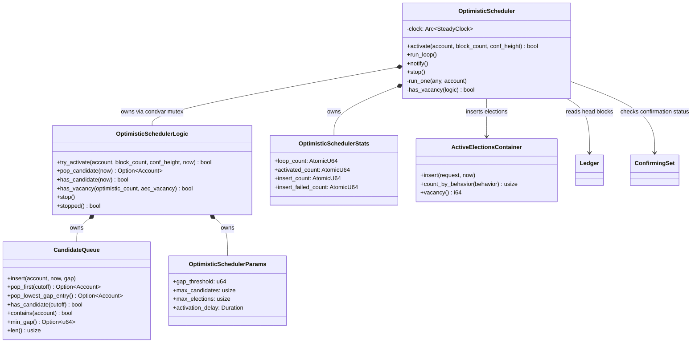

# Optimistic Scheduler

## Purpose

The optimistic scheduler proactively promotes accounts with a large **confirmation gap** — the difference between an account's total block count and its confirmed height — into the Active Elections Container (AEC).

In the Nano consensus protocol, a block is only confirmed once an election is held for it. Accounts that accumulate many unconfirmed blocks (e.g. after a node restart or during heavy network load) would otherwise stall. The optimistic scheduler detects these accounts during backlog scanning and schedules elections for their head blocks, without waiting for an explicit prioritization request.

The word *optimistic* reflects the strategy: the scheduler bets that accounts with large gaps are worth confirming now, even speculatively, to clear the backlog faster.

## Design

The module follows the **A-frame architecture** used throughout the codebase:

- **Logic** (`OptimisticSchedulerLogic`) — pure computation, no I/O. Decides which accounts qualify, manages the candidate queue, and enforces capacity limits.
- **Application** (`OptimisticScheduler`) — owns the background run loop, reads from the `Ledger`, writes to the `ActiveElectionsContainer`, and consults the `ConfirmingSet`.
- The application layer calls into the logic layer to make all scheduling decisions (the "Logic Sandwich" pattern).

### Components

| Component | Role |
|-----------|------|
| `OptimisticScheduler` | Application. Run loop, ledger access, AEC insertion. |
| `OptimisticSchedulerLogic` | Pure logic. Gate-keeps activation, manages the candidate queue. |
| `CandidateQueue` | Dual-indexed data structure. Supports O(log n) pop-by-highest-gap and O(1) account lookup. |
| `OptimisticSchedulerParams` | Configuration (gap threshold, capacity, election cap, activation delay). |
| `OptimisticSchedulerStats` | Atomic telemetry counters exposed via `StatsSource`. |

### Activation flow

1. The backlog scan calls `OptimisticScheduler::activate(account, block_count, confirmation_height)`.
2. `OptimisticSchedulerLogic::try_activate` computes `gap = block_count − confirmation_height`.
3. If `gap < gap_threshold` the account is rejected. If the queue is full, the account must have a strictly higher gap than the current minimum to evict it; otherwise it is rejected.
4. Accepted accounts are enqueued in `CandidateQueue` with their insertion timestamp.

### Scheduling (run loop)

1. The run loop wakes when there is AEC vacancy and a candidate old enough (older than `activation_delay`).
2. Candidates are popped in descending gap order — the most-backlogged account first.
3. For each account the scheduler looks up the head block in the ledger, checks it is not already confirmed, and inserts it into the AEC as `ElectionBehavior::Optimistic`.
4. The run loop caps optimistic elections at `max_elections` and respects the overall AEC vacancy.

### CandidateQueue internals

The queue maintains two parallel indices:

- `by_account: HashMap<Account, u64>` — O(1) existence check and gap lookup.
- `by_gap: BTreeMap<u64, Vec<(Account, Timestamp)>>` — ordered by gap, enabling O(log n) highest-gap pop and O(log n) lowest-gap eviction.

When an account is re-activated with a new gap its entry is moved to the correct bucket while **preserving the original insertion timestamp**, so `activation_delay` is not inadvertently reset.

## Class Diagram

