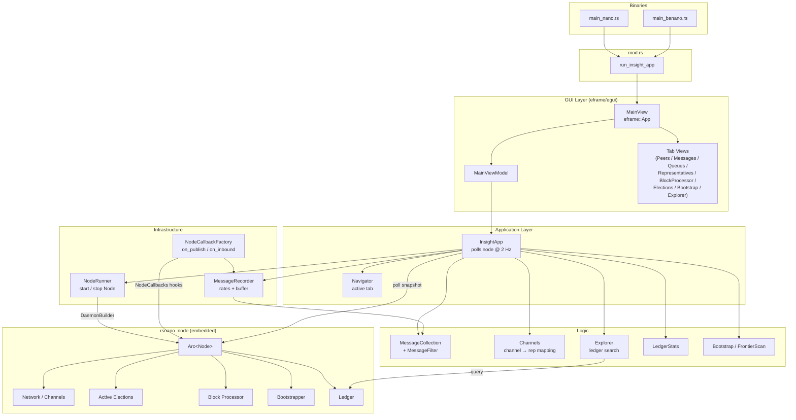

# Insight Architecture

Insight is a desktop GUI tool for inspecting a live Nano/Banano node. It embeds a full node inside the process, then renders real-time data about that node using the [egui/eframe](https://github.com/emilk/egui) immediate-mode UI framework. Two binaries are built from the same codebase: `rsnano-insight` (Nano) and `rsban-insight` (Banano).

## High-Level Layers

Insight follows the **A-frame architecture** used throughout the RsNano codebase:

```
┌─────────────────────────────────────────────────────┐
│                  GUI (View layer)                   │
│  MainView → per-tab view functions (egui widgets)   │
├─────────────────────────────────────────────────────┤
│            Application / ViewModel layer            │
│   MainViewModel  ←→  InsightApp (polls node @ 2Hz)  │
├────────────────────┬────────────────────────────────┤
│       Logic        │        Infrastructure          │
│  MessageCollection │  NodeRunner (owns Arc<Node>)   │
│  MessageFilter     │  MessageRecorder (callbacks)   │
│  Channels          │  NodeCallbackFactory           │
│  Navigator         │                                │
│  Explorer          │                                │
│  LedgerStats …     │                                │
└────────────────────┴────────────────────────────────┘
```

## Component Overview

### Entry Points

| File | Purpose |
|------|---------|
| `src/main_nano.rs` | Binary entry for Nano; calls `run_insight_app("RsNano Insight")` |
| `src/main_banano.rs` | Binary entry for Banano; same, different name + `banano` feature |
| `src/insight/mod.rs` | Initialises tracing, creates the `eframe` window, instantiates `MainView` |

### Infrastructure

**`NodeRunner`** (`node_runner.rs`)  
Manages the lifecycle of an embedded `rsnano_node::Node`. Spawns a background OS thread that drives a full `DaemonBuilder` run loop. Exposes `start_node()` / `stop_node()` and a `NodeState` enum (Starting → Started → Stopping → Stopped). The running node is held behind `Arc<Mutex<Option<Arc<Node>>>>` so the GUI thread can poll it safely.

**`NodeCallbackFactory`** / **`NodeCallbacks`** (`node_callbacks.rs`)  
Wires into three node-level hooks — `on_publish`, `on_inbound`, `on_inbound_dropped` — and feeds every observed network message into `MessageRecorder`. This is the only place the GUI touches node internals reactively; everything else is polled.

**`MessageRecorder`** (`message_recorder.rs`)  
Wraps `MessageCollection` with a toggle (`start_recording` / `stop_recording`) and a `MessageRatesCalculator` that keeps running per-type message rates. Called from node callbacks on the node's network threads.

### Logic

**`MessageCollection`** (`message_collection.rs`)  
In-memory store for recorded messages. Maintains two lists — `all_messages` and `filtered` — and re-filters on every filter change. `MessageFilter` supports filtering by channel ID, message type+direction pairs, block hash, and account. Type/direction counts are computed independently of the active filter so the stats bar always shows totals.

**`Channels`** (`channels.rs`)  
Maintains a `HashMap<ChannelId, ChannelModel>` of currently connected peers, updated from a sorted channel snapshot. Annotates each channel with telemetry data, representative weight, and a known-rep name. Selecting a channel updates the `MessageCollection` filter so the Messages tab shows only that peer's traffic.

**`Navigator`** (`navigator.rs`)  
Simple enum + struct tracking the currently active tab out of eight: Peers, Messages, Queues, Representatives, Block Processor, Elections, Bootstrap, Explorer.

**`Explorer`** (`explorer.rs`)  
Accepts a free-text search string, interprets it as a block hash or account address, and queries `Ledger::any()` to resolve a `DetailedBlock`.

**`LedgerStats`**, **`Bootstrap`**, **`FrontierScan`**  
Thin wrappers that hold snapshots of subsystem state between 500 ms poll cycles.

### Application Layer

**`InsightApp`** (`app.rs`)  
The central application state struct. Owns every logic component and the `NodeRunner`. Its `update()` method runs at most every 500 ms, pulling fresh snapshots from the running node:
- ledger stats, channels, telemetry, rep weights
- AEC (Active Elections Container) info and bucket snapshots
- block/vote processor queue depths
- confirming set size
- bootstrap queue / frontier scan snapshots
- representative registry and quorum info
- peer score snapshots

### ViewModel / View Layers

**`MainViewModel`** (`gui/main_view.rs`)  
Bridges `InsightApp` state to strongly-typed view models consumed by each tab's render function. Each tab has a corresponding `*ViewModel` struct built on demand from the app state.

**`MainView`** (`gui/main_view.rs`)  
Implements `eframe::App`. On every frame:
1. Calls `MainViewModel::update()` (throttled to 2 Hz)
2. Renders the top controls panel (node start/stop, message recorder toggle, search bar)
3. Renders the tab bar
4. Delegates the central area to the active tab's view function
5. Renders the bottom stats bar (message rates + ledger stats)
6. Calls `ui.request_repaint()` to drive continuous updates

Each tab is a standalone function or struct in `gui/`:

| Tab | File | Shows |
|-----|------|-------|
| Peers | `gui/peers.rs`, `gui/channels.rs` | Connected channels with rep weight, telemetry |
| Messages | `gui/message_tab.rs`, `gui/message_table.rs`, `gui/message_stats.rs` | Recorded network messages with filtering |
| Queues | `gui/queue_group.rs` | AEC, block processor, vote processor, confirming set depths |
| Representatives | `gui/representatives.rs` | Rep weights, quorum info |
| Block Processor | `gui/block_processor.rs` | Block processor queue state |
| Elections | `gui/elections.rs` | AEC bucket grid; drill into individual elections |
| Bootstrap | `gui/bootstrap.rs` | Bootstrap download queue / peer scores / frontier scan (sub-views) |
| Explorer | `gui/explorer.rs` | Block/account lookup against the local ledger |

## Mermaid Diagram


